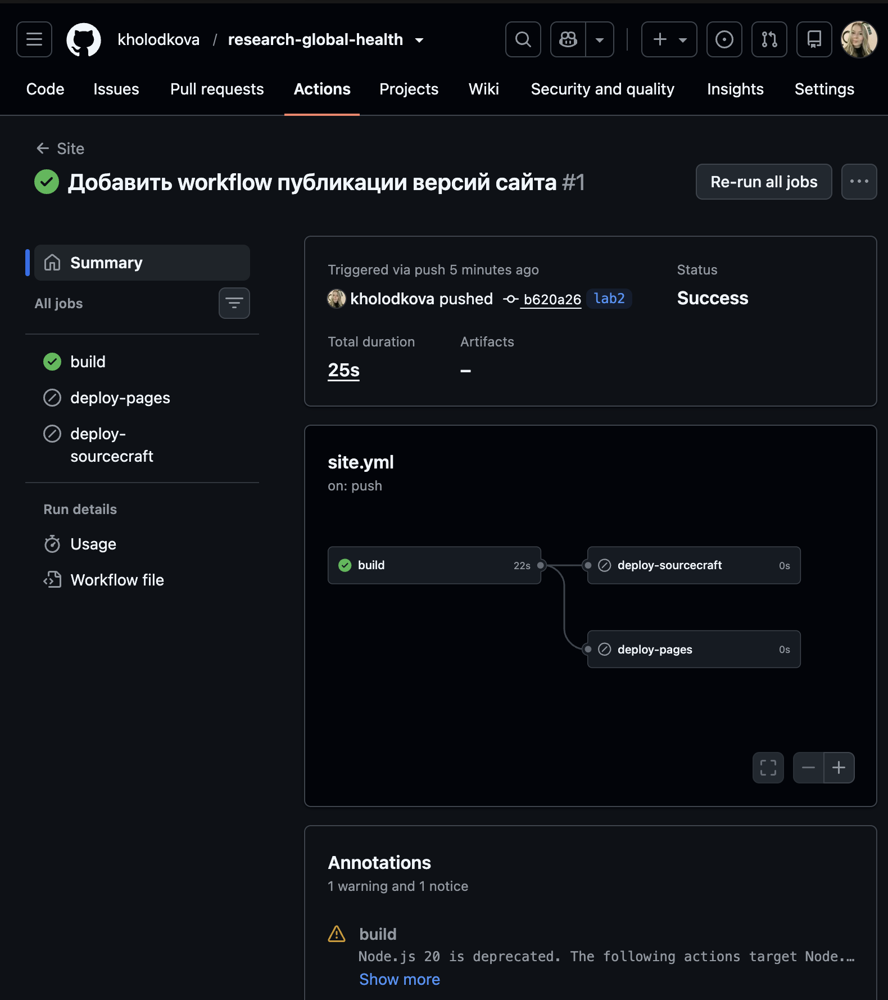
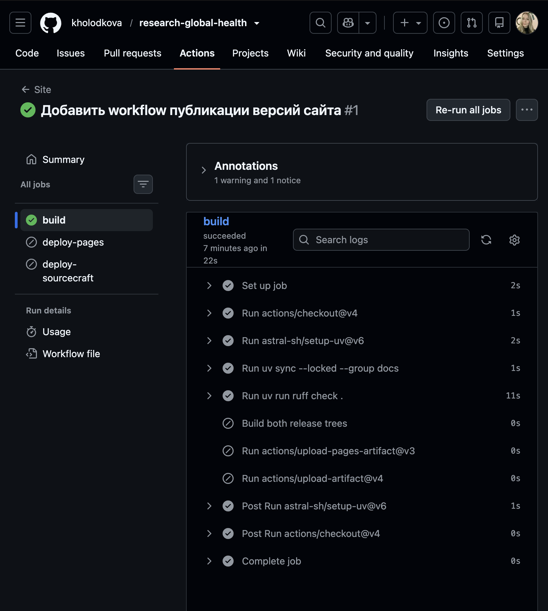
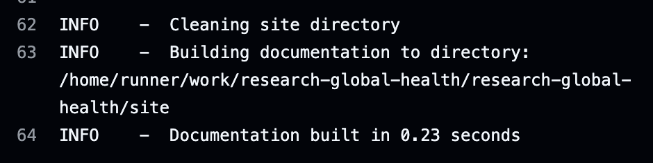

# Лабораторная работа №2

## Генераторы статических сайтов

Цель работы — освоить публикацию результатов экспериментов с помощью генератора
статических сайтов на Python и автоматизацию сборки и развёртывания.

**Статус:** сайт опубликован в версиях `v1.0` и `v1.1` на GitHub Pages и
SourceCraft Sites. Подготовлены T4 и P5, пройдены CI/CD-проверки и проверен
русский поиск.

Полный [отчёт по требованиям задания](report.md) содержит ссылки, пайплайны,
измерения, отладку и вывод.

## Выбранные задания

| Задание | Планируемый результат |
| --- | --- |
| T4 — модель доставки и безопасность | Сравнение способов развёртывания, прав доступа и рисков; проверка работы без внешних CDN |
| P5 — версионирование сайта | Версии v1.0 и v1.1 с различающимися результатами, переключатель, алиас latest, публикация по тегам и проверка русского поиска |

## Выбранные инструменты

- MkDocs с темой Material для сборки сайта из Markdown.
- uv и lock-файл для управления зависимостями.
- GitHub Actions для будущей автоматизации сборки и публикации.
- GitHub Pages и SourceCraft Sites как площадки размещения.
- mike для версионирования сайта; переключение версий проверено на локальном стенде.

## Проверка сборки в GitHub Actions

После push ветки `lab2` workflow **Site** успешно выполнил проверки и сборку.
Подтверждение: [запуск Site №1 от 27 сентября 2026 года](https://github.com/kholodkova/research-global-health/actions/runs/36340827828),
коммит `b620a26`. [Лог задания build](https://github.com/kholodkova/research-global-health/actions/runs/36340827828/job/108680441745).

Задания `deploy-pages` и `deploy-sourcecraft` пропущены согласно условиям workflow:
push в ветку проверяет сайт, а публикация предусмотрена только для тегов выпусков.
Этот запуск подтверждает сборку, но не развёртывание сайта на площадках.

### Замеры этого запуска

| Объект измерения | Время | Источник |
| --- | ---: | --- |
| Весь workflow Site | 25 с | Summary, Total duration |
| Задание build | 22 с | Статус задания build |
| Сборка документации MkDocs | 0,23 с | Строка лога Documentation built |

Это значения одного запуска, а не средние по серии измерений. Время MkDocs
не включает установку окружения и остальные проверки задания build.

### Скриншоты

**Общий результат:** ветка, коммит, статус Success и схема заданий.

**Шаги build:** установка окружения и успешное выполнение шага проверок.

**Фрагмент лога того же запуска:** завершение сборки документации.

В аннотациях запуска присутствует предупреждение об устаревании Node.js 20
в используемых actions. Оно не привело к падению этого запуска; обновление
actions требует отдельной проверки. Это предупреждение не считается
проваленным запуском для отчёта.

## Дальнейшая работа

По мере выполнения сюда будут добавлены ход работы, результаты T4 и P5,
ссылки на опубликованные сайты, тексты пайплайнов, скриншоты,
таблицы измерений, раздел отладки и выводы.
