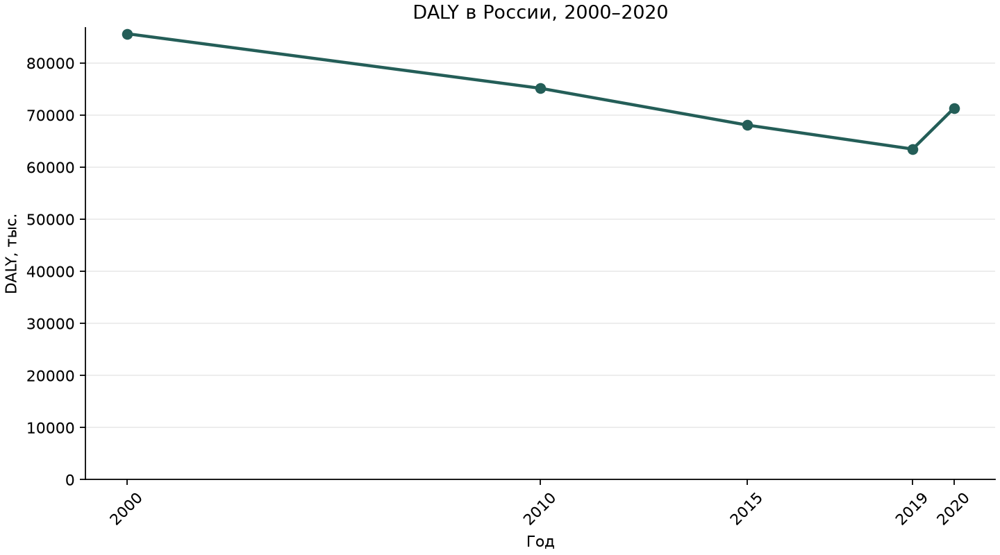

# DALY в России: 2000–2020

Оба пола, все возрасты, все причины. DALY указаны в тысячах.

| Год | DALY, тыс. | Изменение к 2000 году, % |
| --- | ---: | ---: |
| 2000 | 85630.21 | 0.00 |
| 2010 | 75146.65 | -12.24 |
| 2015 | 68082.57 | -20.49 |
| 2019 | 63477.24 | -25.87 |
| 2020 | 71327.53 | -16.70 |

Изменение: `(DALY / DALY_2000 - 1) × 100%`.

Это абсолютный объём DALY, не показатель на душу населения и не возраст-стандартизованный показатель. Линии соединяют доступные годы; промежуточные годовые оценки не представлены.

Источник: Global Health Estimates 2021: Disease burden by Cause, Age, Sex, by Country and by Region, 2000–2021. Geneva: World Health Organization; 2024.

[Источник WHO GHE](https://www.who.int/data/gho/data/themes/mortality-and-global-health-estimates/global-health-estimates-leading-causes-of-dalys).

Исходные оценки принадлежат WHO; проценты и визуализация подготовлены автором учебного проекта. WHO не является автором этого анализа и не подтверждает его выводы. Использование данных регулируется [условиями WHO](https://www.who.int/about/policies/publishing/data-policy/terms-and-conditions), а не лицензией кода проекта.
