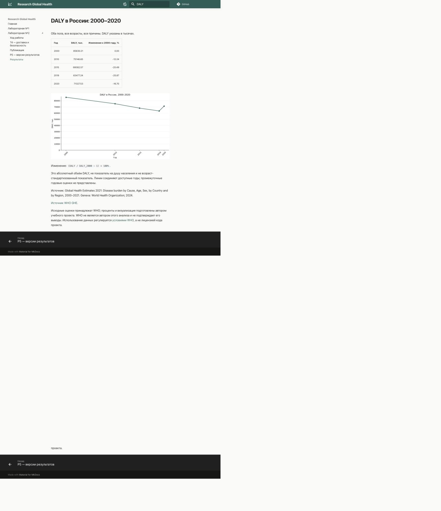
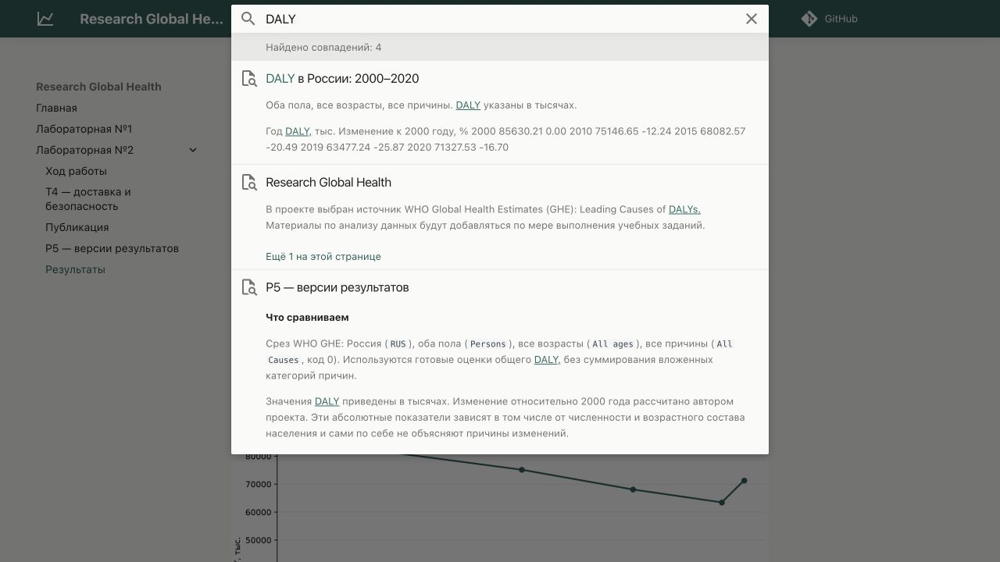

# T4 — доставка сайта и безопасность

Задача — сравнить способы публикации статического сайта и определить границы
доступа автоматизации. Для проекта важна целостность таблиц и графиков WHO:
подмена HTML или JavaScript может исказить опубликованный результат даже при
правильном исходном расчёте.

**Статус:** подготовлен теоретический анализ и рассмотрена конфигурация проекта.
Выполнен локальный эксперимент с запретом внешних ресурсов. Публикация на площадках ещё не подтверждена.
Документация проверена 27 сентября 2026 года.

## Сравнение способов доставки

В таблице указаны рекомендуемые минимальные права. Фактические возможности
зависят от настроек репозитория, сервера или облачного провайдера.

| Способ | Учётные данные и необходимые права | Последствия компрометации | Ограничение риска |
| --- | --- | --- | --- |
| Push в `gh-pages` | Временный `GITHUB_TOKEN` с `contents: write`; правила репозитория должны разрешать запись | Подмена сайта и доступная токену запись в репозиторий. Само разрешение не ограничено одной веткой | Защита исходных веток, отдельное задание публикации, минимальные permissions |
| `upload-pages-artifact` + `deploy-pages` | Для публикации: `pages: write`, `id-token: write`; отдельный постоянный PAT не требуется | Подмена публикуемого сайта в пределах разрешённого развёртывания; эти права сами по себе не дают запись исходников | Environment `github-pages`, ограничения разрешённых refs, публикация только проверенного артефакта |
| `rsync` / `scp` по SSH | Отдельный закрытый deploy-ключ; серверный пользователь с записью в каталог сайта | Изменение или удаление доступных пользователю файлов; при доступном shell — выполнение команд от его имени | Без sudo, отдельный пользователь, ограничения ключа и команд, проверка ключа сервера |
| FTP / SFTP | Пароль отдельной учётной записи; для SFTP также возможен SSH-ключ; запись только в каталог сайта | Подмена и удаление файлов в пределах прав учётной записи. Обычный FTP дополнительно допускает перехват незашифрованных данных | Предпочесть SFTP; ограничить каталог и права. FTPS использует TLS и отличается от SFTP |
| S3 API | Access key / secret key либо временные учётные данные роли; загрузка в выбранный bucket/prefix | Подмена или удаление объектов, возможные расходы на хранение и запросы; масштаб зависит от политики | Ограничить bucket/prefix и операции; не выдавать управление всем облачным аккаунтом |

Официальный механизм Pages требует `pages: write` и `id-token: write` у задания
публикации. Идентификационный OIDC-токен используется для проверки происхождения
запуска. Источник: [GitHub — custom workflows для Pages](https://docs.github.com/en/pages/getting-started-with-github-pages/using-custom-workflows-with-github-pages).

Для записи через Git объём доступа задают permissions `GITHUB_TOKEN` и правила
репозитория, а не название целевой ветки.
Источник: [GitHub — права GITHUB_TOKEN](https://docs.github.com/en/actions/security-for-github-actions/security-guides/automatic-token-authentication).

Для S3 загрузка обычно требует `s3:PutObject`; синхронизация со списком файлов —
`s3:ListBucket`, удаление устаревших объектов — `s3:DeleteObject`.
Multipart-загрузка и шифрование могут требовать дополнительных прав.
Это обозначения AWS; в совместимом хранилище нужно проверить модель прав
провайдера. Источник: [Amazon S3 — разрешения операций API](https://docs.aws.amazon.com/AmazonS3/latest/userguide/using-with-s3-policy-actions.html).

SFTP работает поверх SSH; FTP и FTPS являются другими протоколами.
При использовании TLS проверку сертификата сервера нельзя заменять отключением
проверки. Источники: [OpenSSH — SFTP](https://man.openbsd.org/sftp),
[curl — проверка сертификатов](https://curl.se/docs/sslcerts.html).

## Почему секреты не передаются в PR из форка

Автор форка может изменить выполняемый код, например добавить отправку
переменной окружения на свой сервер. Поэтому обычный запуск `pull_request`
из форка не получает секреты основного репозитория; `GITHUB_TOKEN` по умолчанию
ограничен чтением. Для некоторых частных репозиториев администратор может
изменить эти настройки — это отдельное решение о доверии.

Маскирование в логах не предотвращает сетевую отправку секрета.
Источники: [GitHub — секреты](https://docs.github.com/en/actions/how-tos/write-workflows/choose-what-workflows-do/use-secrets),
[GitHub — события из форков](https://docs.github.com/en/actions/reference/workflows-and-actions/events-that-trigger-workflows#pull_request).

В нашем workflow PR выполняет проверки без публикации. Нельзя обходить эту
границу переходом на `pull_request_target` с последующим исполнением кода
из недоверенного PR: привилегированный контекст может раскрыть секреты.

## SHA и атаки через зависимости

Тег action, например `@v4`, может начать указывать на другой коммит.
Полный SHA фиксирует конкретную ревизию; перед обновлением нужно проверить
её происхождение и изменения. Это не доказывает безопасность самого кода
и не фиксирует автоматически загружаемые им внешние зависимости.

Supply-chain-атака в этом сценарии — внедрение вредоносного кода в action
или его зависимость. Возможная цепочка: скомпрометированный action меняет
собранный HTML, а штатный deploy публикует подмену. При доступных секретах
возможна также их кража. Проверка HTTP 200 не обнаружит все такие подмены.

Защита: проверенные actions с полным SHA, review обновлений, минимальные права,
разделение сборки и доставки, отсутствие секретов при исполнении недоверенного
кода. Источник: [GitHub — безопасное использование Actions](https://docs.github.com/en/actions/reference/security/secure-use).

## Проверка SSH-сервера через known_hosts

Deploy-ключ подтверждает личность клиента. Запись `known_hosts` позволяет
клиенту проверить сервер — это разные направления проверки.

1. Получить публичный ключ сервера или его SHA256 fingerprint через доверенный
   канал: консоль провайдера или администратора.
2. Если ключ получен через `ssh-keyscan`, независимо сверить fingerprint.
   Сам `ssh-keyscan` не подтверждает подлинность ответа.
3. Поместить проверенную запись в файл `known_hosts` раннера; для нестандартного
   порта использовать имя вида `[host]:port`.
4. Включить `StrictHostKeyChecking=yes` и указать этот файл через
   `UserKnownHostsFile`. При неожиданной смене ключа остановить доставку
   и проверить причину, а не автоматически принимать новый ключ.

Публичный ключ сервера не является секретом, но целостность доверенной записи
важна. Источники: [OpenSSH — ssh-keyscan](https://man.openbsd.org/ssh-keyscan),
[OpenSSH — ssh_config](https://man.openbsd.org/ssh_config).

## Применение к research-global-health

По текущему `.github/workflows/site.yml`:

- проверки используют `contents: read`;
- отдельный job Pages получает `pages: write` и `id-token: write`;
- SourceCraft получает `SOURCECRAFT_TOKEN` только на шаге доставки через
  переменную окружения и `GIT_ASKPASS`, без записи токена в URL remote;
- публикация предусмотрена для тегов `v1.0` и `v1.1`; сборка проверяет,
  что коммит тега входит в `origin/master`;
- actions пока указаны по тегам. Закрепление по SHA остаётся улучшением,
  которое требует отдельной проверки и изменения workflow.

Токен SourceCraft должен иметь запись только в предназначенный для сайта
репозиторий. Его фактические права здесь не проверены. При утечке необходимо
отозвать токен, проверить изменения сайта и выпустить новый с ограниченными правами.

**Вывод для проекта:** официальный Pages deploy удобен разделением сборки
и публикации без постоянного PAT. Для отечественной площадки выбран SourceCraft
Sites с доставкой через Git по HTTPS. SSH оправдан при наличии собственного
сервера, S3 — при использовании объектного хранилища. Эти альтернативы в рамках
T4 сравниваются теоретически, а не объявляются реализованными.

## Проверка без внешних CDN

27 сентября 2026 года проверена страница `/lab2/p5/results/` сборки коммита
`aaaae87`. Использован встроенный Chromium-браузер, без изменения исходников
или ресурсов проверяемой сборки. Это локальный эксперимент, не проверка хостинга.

### Методика

Одна папка `site/`, полученная через `mkdocs build --strict`, обслуживалась
двумя временными HTTP-серверами на `127.0.0.1`: обычным (порт 8011) и с CSP
(порт 8012). Ответы содержали `Cache-Control: no-store`; сервер не применял
сжатие. Разные порты дают разные origins. На странице выполнялся запрос `DALY`.

Второй сервер добавлял следующий заголовок, проверенный отдельным HTTP-запросом:

```text
Content-Security-Policy: default-src 'self' data: blob:; script-src 'self' 'unsafe-inline' 'unsafe-eval' blob:; style-src 'self' 'unsafe-inline'; connect-src 'self'; font-src 'self' data:; img-src 'self' data:; worker-src 'self' blob:
```

Так браузер не может загрузить ресурсы с внешнего origin, включая CDN.
Встроенные скрипты и стили разрешены для сохранения поведения темы. Это
экспериментальный заголовок, не рекомендация готовой production-политики CSP.
Обычные ссылки на WHO и GitHub остаются ссылками; их открытие не проверялось.

Сервер записывал пути запросов и статусы. Вес рассчитан как сумма размеров
уникальных успешно запрошенных локальных файлов, включая HTML, favicon,
поисковый индекс и скрипты worker. Повторный запрос одного пути не увеличивает
сумму. Это **не полный сетевой трафик**: заголовки, тела ошибок, внешние API
и транспортные накладные расходы в сумму не входят.
[Перечень ресурсов и размеры CSV](../assets/measurements/cdn-resources.csv).

### Измерения

| Показатель | Обычная загрузка | Внешние ресурсы запрещены CSP |
| --- | ---: | ---: |
| HTML страницы, байт | 21 759 | 21 759 |
| График PNG, байт | 41 052 | 41 052 |
| Поисковый индекс, байт | 93 534 | 93 534 |
| Уникальные локальные файлы с HTTP 200 | 11 | 11 |
| Суммарный размер этих файлов, байт | 479 486 | 479 486 |
| То же в КиБ (1024 байта) | 468,25 | 468,25 |
| Изменение размера локальных ресурсов | — | 0 байт |

Измерения относятся к указанному коммиту: добавление этого отчёта изменит
поисковый индекс, поэтому размер последующих сборок будет другим.
Число всех внешних запросов и их объём не измерялись: журнал локального
сервера их не видит. Утверждение «внешних запросов нет» из этой таблицы не следует.

### Проверка функций

| Проверка | Обычная загрузка | С CSP |
| --- | --- | --- |
| Таблица и график DALY | Отображаются | Отображаются |
| Оформление и иконки | Отображаются | Отображаются |
| Поиск `DALY` | 4 совпадения | 4 совпадения |
| Ссылка на репозиторий | Есть; отображаются счётчики GitHub | Есть; счётчики не отображаются |
| Переключатель версий | Не проверен на этом стенде | Не проверен на этом стенде |
| MathJax/KaTeX | Не используется на странице | Не проверялся |

Счётчики репозитория — необязательная внешняя функция темы. Их исчезновение
не мешает чтению результатов. Поиск использует локальные индекс, worker и
русский языковой модуль. Это проверка работоспособности поиска, а не пять
морфологических запросов из P5 — они остаются отдельным заданием.

Обычная сборка MkDocs возвращает 404 для `versions.json`: это дерево одной
версии без публикации через mike. Такой же ответ получен в обоих режимах;
он не вызван блокировкой CDN. Проверять переключатель и `latest` нужно на
дереве mike и затем на опубликованном сайте.





### Вывод и локальное размещение ресурсов

Для проверенной страницы перенос ресурсов не потребовался: `font: false`
отключает загрузку Google Fonts, CSS, JavaScript и график уже обслуживаются
локально, а иконки представлены в странице. При блокировке внешних ресурсов
основное содержимое и поиск сохранили работоспособность; вес локальных файлов
не изменился.

Если позднее появятся внешние шрифты или MathJax/KaTeX, их можно разместить
в `docs/assets/`, подключить относительными путями и сохранить лицензии.
Потребуется включить также связанные файлы шрифтов и модулей, а затем повторить
проверку. Локальное размещение увеличит объём дерева сайта на размер добавленных
файлов; изменение передаваемых байтов зависит от сжатия и кэша и требует
отдельного измерения. Эффект для формул в текущем эксперименте не установлен.
